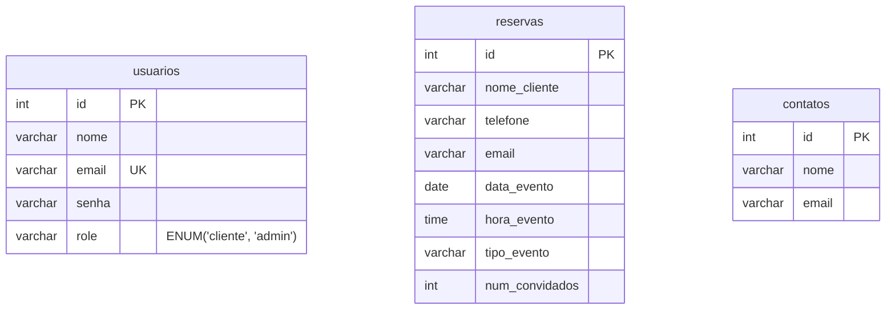

## ⚙️ Funcionalidades

### Páginas Públicas

  * ✅ **Homepage:** Apresentação do buffet, seção "Sobre" e links para os principais serviços.
  * ✅ **Página de Catálogo:** Menu completo com filtro de categorias (Coquetel, Doces, Jantares, Árabe) implementado com JavaScript.
  * ✅ **Página de Menu de Natal:** Página de conteúdo estático com layout e filtros próprios.
  * ✅ **Formulário de Reserva:** Permite que clientes solicitem uma reserva. Inclui validação de dados em JavaScript e envia um e-mail de confirmação automático para o cliente.
  * ✅ **Rolagem Suave:** Navegação interna entre seções da página com animação suave.

### Painel Administrativo

  * 🔒 **Login Seguro:** Autenticação para administradores com senhas criptografadas (hash).
  * 📊 **Dashboard Profissional:** Painel de controle com design personalizado que lista todas as reservas recebidas.
  * 🗑️ **Exclusão de Reservas:** O administrador pode remover solicitações de reserva com um clique.
  * 🔐 **Acesso Protegido:** Todas as rotas do painel são protegidas, redirecionando usuários não autenticados para a página de login.

-----

## 🛠️ Tecnologias e Conceitos Aplicados

  * **Backend:** PHP 8.2+ (Orientado a Objetos)
  * **Banco de Dados:** MySQL / MariaDB
  * **Arquitetura:** MVC (Model-View-Controller)
  * **Gerenciador de Dependências:** Composer
  * **Bibliotecas PHP:**
      * `vlucas/phpdotenv`: Para gerenciamento seguro de variáveis de ambiente.
      * `phpmailer/phpmailer`: Para o envio de e-mails de confirmação.
  * **Segurança:**
      * **Senhas com Hash:** Uso de `password_hash()` e `password_verify()` para senhas.
      * **Prevenção de SQL Injection:** Uso exclusivo de Prepared Statements com PDO.
      * **Prevenção de XSS:** Filtragem de dados com `htmlspecialchars()` nas Views.
  * **Frontend:**
      * HTML5 e CSS3 (com estilos embutidos e externos).
      * Bootstrap 5 para componentes de UI.
      * JavaScript "baunilha" para interatividade (filtros, máscaras de formulário, rolagem suave).

-----

## 🏗️ Arquitetura do Projeto

### Padrão MVC

  * **Model:** Camada de acesso aos dados, responsável por toda a comunicação com o banco de dados (`app/Models`).
  * **View:** Camada de apresentação, contendo o HTML e a exibição dos dados (`app/Views`).
  * **Controller:** Camada de controle que recebe as requisições, interage com os Models e renderiza as Views (`app/Controllers`).
  * **Front Controller:** Todas as requisições são centralizadas no `public/index.php`.

### Modelagem de Dados (ERD)

O sistema utiliza um banco de dados unificado (`ibas_buffet_db`) com a seguinte estrutura:



-----

## 🚀 Instalação e Execução

Siga os passos abaixo para executar o projeto localmente.

### Pré-requisitos

  * PHP 8.1 ou superior
  * Composer
  * Servidor de Banco de Dados MySQL (como o do XAMPP)
  * Git

### Passos

1.  **Clone o repositório:**

    ```bash
    git clone https://github.com/seu-usuario/seu-repositorio.git
    ```

    *(Substitua `seu-usuario/seu-repositorio` pelo caminho do seu repositório no GitHub)*

2.  **Navegue até a pasta do projeto:**

    ```bash
    cd nome-da-pasta
    ```

3.  **Instale as dependências do Composer:**

    ```bash
    composer install
    ```

4.  **Configure o ambiente:**

      * Copie o arquivo `.env.example` para um novo arquivo chamado `.env`.
      * Abra o arquivo `.env` e preencha com as suas credenciais do banco de dados e do servidor de e-mail (SMTP).

5.  **Crie e popule o banco de dados:**

      * Crie um banco de dados vazio no seu MySQL/DBeaver com o nome que você definiu em `DB_DATABASE` no arquivo `.env`.
      * Importe o script `database.sql` (contendo a estrutura das tabelas e o usuário admin) para o banco de dados.
        *(**Nota:** Você precisará criar um arquivo `database.sql` na raiz do projeto e colar o [script SQL que geramos](https://www.google.com/search?q=https://gemini.google.com/share/c1676839352e) nele).*

6.  **Inicie o servidor local do PHP:**

      * No terminal, na pasta raiz do projeto, execute:

    <!-- end list -->

    ```bash
    php -S localhost:8000 -t public
    ```

7.  **Acesse a aplicação:**

      * Abra seu navegador e acesse: `http://localhost:8000`

-----

## 🔑 Credenciais de Acesso

Para acessar o painel administrativo, utilize as seguintes credenciais padrão:

  * **Email:** `admin@ibas.com`
  * **Senha:** `admin123`

-----

## 📄 Licença

Este projeto está sob a licença MIT.
